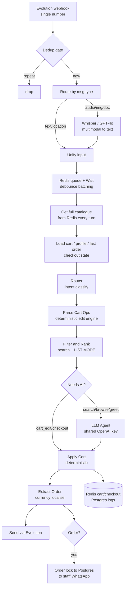
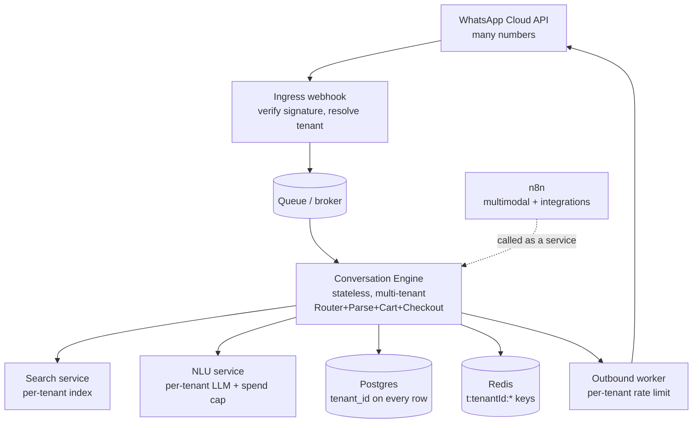

# Family Shopper → CloudBSS: Architecture & SaaS Conversion Report

*Reviewed as: Senior SaaS Architect · WhatsApp Commerce Expert · n8n Expert · Product Manager*
*Subject: the production `whatsapp-multimodal` n8n workflow (Family Shopper, single store)*

---

## 0. Executive verdict (brutally honest)

This workflow is an **excellent single-tenant prototype and a terrible multi-tenant product.** The conversational logic — multilingual understanding, deterministic cart editing, quantity parsing, checkout state machine, currency localisation, defensive guards — is genuinely strong and worth protecting as *intellectual property*. But the **delivery mechanism** (one Evolution session, one OpenAI key, hardcoded staff numbers, global Redis keys, business logic buried in 600-line code nodes, executions parked on Wait nodes) cannot become a platform for thousands of shops. 

**The honest path:** treat this workflow as the *executable specification*. Port its brain into versioned application code (your CloudBSS Laravel app), put the official WhatsApp Cloud API in front, and keep n8n only for what it's good at: multimodal ingest and integration glue. Do **not** try to "make this workflow multi-tenant." That road ends in pain.

---

## 1. Architecture Review

### 1.1 How it works today

A single webhook (`/whatsapp-multimodal`) receives every Evolution event for **one** WhatsApp number. The pipeline is a long linear chain with a message-batching loop and an AI fork. The cleverest design choice is that **the cart, checkout, and edits are deterministic** — the LLM is only consulted for open "search/browse/greeting" turns, and it has been deliberately stripped of the power to write the cart (`AI [CART] fallback REMOVED (Change 1)`).

### 1.2 The five flows

**Message flow.**
`Receive WhatsApp → If (fromMe=false) → Parse Message Data → Dedup Incr/Gate (drop repeat webhooks) → Filter Allowed Numbers → Wait 2s → Mark as Read → Route by Message Type`. Media is normalised to text (`Transcribe Audio` Whisper, `Analyze Image`/`Transcribe Document` GPT-4o, location → maps link) and everything converges at `Unify Input`. Then the **debounce**: `Queue Message` (Redis list push) → `Wait for More Messages` → `Get Queued Messages` → `Is Last Message?`. Only the *last* rapid-fire message survives; the rest stop. The survivor runs `Concatenate Messages` so "rice" + "and sugar" + "2 bread" sent as three bubbles become one logical request.

**Product flow.**
`Get Cache (fs:catalogue) → Get Products`. The **entire catalogue** is pulled from Redis and JSON-parsed on every turn, with store-wide discount re-applied in JS. Search happens in `Filter & Rank`: tokenise → strip ~300 stopwords/Hinglish fillers → synonym-map (sakar→sugar, tel→oil…) → fuzzy match (Levenshtein ≤1) → rank by score/stock/popularity. It has a **LIST MODE** that splits on `and`/`,`/`&` and matches every line.

**Cart flow.**
`Router` classifies intent. `Parse Cart Ops` is the deterministic edit engine: multi-item split, quantity extraction, pronouns ("make it 5", "one more"), ordinals ("remove the second one"), arithmetic (double/half/reduce by N), replacement (swap/instead), inline clears, and **clarify-on-price-spread** ("5 rice" when rice runs UGX 6,300–70,000 → ask, never guess). `Apply Cart` applies the actions, runs the checkout state machine, and persists to Redis (`cart:{jid}`, 24h TTL, 30-min inactivity expiry).

**Order flow.**
At final confirmation, `Apply Cart` emits an `[ORDER]` block → `Extract Order` parses it and localises currency → `Order Confirmed?` → `Order Lock Incr/Gate` (120s dup-protection) → `Order Number` (Redis `incr fs:order_seq`) → `Format Order No` (FS-####) → parallel: `Insert Order (Postgres)`, `Send Order No`, `Notify Staff` (3 hardcoded numbers), `Save Last Order` (enables reorder/history).

**Delivery flow.**
There is **no delivery flow in software.** Location is captured (pin or area+landmark) into the order; staff are notified by WhatsApp and "will call to arrange delivery." No driver assignment, status tracking, ETA, or delivery reminders exist here.

### 1.3 Current architecture diagram



---

## 2. Scalability Review — what breaks, and in what order

| Layer | 100 shops | 1,000 shops | 10,000 shops |
|---|---|---|---|
| **Evolution (Baileys)** | Straining | **Broken** | Impossible |
| **OpenAI (shared key)** | Rate-limit risk | **429 storms + cost bomb** | Unviable |
| **n8n Wait-node executions** | OK | Saturating | **Melts** |
| **Redis (full catalogue/turn)** | OK | Bandwidth/CPU heavy | Hot-key pain |
| **Postgres (per-turn logs, chat memory)** | OK | Write amplification | Needs sharding |

**What breaks *first*: WhatsApp transport + the shared OpenAI key — well before 1,000 shops.**

- **Evolution API is unofficial (Baileys).** One session per shop number. Hundreds of concurrent sessions = constant disconnects, QR re-pairing, and **ban risk** — fatal for a paid product. There is no realistic path to thousands of numbers on Evolution. *This is the #1 blocker.*
- **One OpenAI account = one rate limit shared across all tenants.** A busy hour at 200 shops throws 429s that hit *everyone*, and per-message GPT calls (plus Whisper/vision) make unit economics fail long before 10k. No per-tenant metering or spend cap exists.
- **n8n Wait nodes park live executions.** `Wait 2s`, `Wait for More Messages`, `Wait Between Messages` each hold an execution open. Thousands of concurrent chats = thousands of parked executions → worker/DB saturation. n8n is an orchestrator, not a high-concurrency conversation server.
- **`Get Products` ships and re-parses the whole catalogue every message.** Fine for one shop's ~100 SKUs; at 10k shops × larger catalogues × every turn it's a CPU/bandwidth sink and a Redis hot-key.
- **Write amplification:** `cart_log` + `checkout_log` + `whatsapp_chat_memory` insert on essentially every turn into one un-partitioned Postgres. Grows unbounded.

**Multi-tenant correctness bug (worse than perf):** Redis keys are **global** — `cart:{remoteJid}`, `cust:{remoteJid}`, `lastorder:{remoteJid}` are keyed by the *customer's* number with **no tenant prefix**. The captured `instance` is never used to scope data. If one customer ever shops at two CloudBSS stores, their carts and history **collide**. Staff numbers and `fs:*` keys are hardcoded to Family Shopper. This workflow is structurally single-tenant.

---

## 3. Product Search Analysis — why "rice and sugar" / "2kg sugar and bread" misbehave

### 3.1 Root cause
The deterministic multi-item engine (`Parse Cart Ops`) **only runs when `Router` labels the message `cart_edit`.** Question-form and unit-attached messages don't reliably get that label, so they fall through to `search` → `Filter & Rank` → **the LLM**, and correctness becomes LLM-dependent.

### 3.2 The exact node and lines
**`Router`** decides intent. Its shopping detector is `itemLike`, which tests each fragment against roughly `^(?:add|need|buy|get )?\d+\s+\S`. Two gaps:

1. **"2kg sugar"** — `\d+\s+` requires a digit *then whitespace*. "2kg" is digit-then-letters, no space, so it **fails** the test. "bread" has no quantity at all, so it fails too. Net: `itemLike = 0`, no edit verbs → intent stays `search`.
2. **"Do you have rice and sugar?"** — no digits, no edit verb, has "?" → intent `search`.

On the `search` path, `Filter & Rank` *does* have LIST MODE (it splits on `and`/`,`), but it emits a **text block for the LLM to format**, and the reply quality then rides on the model (and on the `gpt-5.4-mini` identifier actually resolving on your account — verify that). So: the brain that can handle this perfectly is sitting *right there in `Parse Cart Ops`*, but the router never routes to it.

### 3.3 The fix (three changes, smallest first)
1. **Make `itemLike` unit-aware and noun-aware.** Detect `\d+\s*(kg|g|gm|ml|l|ltr|pc|pcs|pkt|packet|dozen)?\s+\w` *and* "any fragment that resolves to a catalogue product." If a fragment resolves via `resolve()`, it's a shopping fragment regardless of quantity.
2. **Run one unified deterministic shopping parse for BOTH `search` and `cart_edit`.** Question-form ("do you have…") becomes *browse-with-options* (don't auto-add), explicit/quantified becomes *add*. Multi-item extraction must **never** depend on the LLM.
3. **Make `Filter & Rank` return structured options**, not a text blob, so the conversational "Rice: … / Sugar: …" reply is rendered deterministically (Section 4). The LLM becomes optional polish, not the parser.

This is exactly the rewrite we'd started on the Laravel side — but your n8n engine already contains 90% of the logic; the bug is **routing, not parsing**.

---

## 4. Conversational Commerce Improvements

Target shop-assistant behaviour, all deterministic:

**Multi-product + question form**
```
Customer: Do you have rice and sugar?
Bot: Yes 👍
*Rice:*
 1. Pakistan Rice 5kg — UGX 38,000
 2. Local Rice 1kg — UGX 6,300
*Sugar:*
 3. Kinyara Sugar 1kg — UGX 4,500
 4. Sugar 2kg — UGX 8,800
Reply with the numbers you want (e.g. 1, 3).
```
Implementation: per requested item, run `Filter & Rank`; group results under the item label; build a **flat numbered option list** stored in state; a numeric reply ("1,3") or a name maps back to products and adds them. (This is the `state['options']` + selection-resolver pattern.)

- **Category search:** add `category ILIKE` to matching so "rice" surfaces the rice category; if >1, show options instead of "not found."
- **Recommendations / related products:** after an add, suggest **one** complement from a small co-purchase map (tea→sugar, bread→milk, rice→oil). Your AI prompt already instructs this; make it a deterministic rule so it survives the LLM being off.
- **Ambiguity → ask, never guess:** keep `clarifyCheck` (price-spread guard) and extend it to multi-item.
- **Human feel:** keep batching, multilingual understanding, ordinals/pronouns, reorder/history/escalation, currency localisation. This is your moat — protect it.

---

## 5. SaaS Conversion Plan — n8n vs application code vs APIs

**Principle:** *orchestration in n8n, business logic in code, integrations behind APIs.* Stop shipping core logic as code nodes.

**Move into application code (CloudBSS service) — your IP, must be tested & versioned:**
`Router`, `Parse Cart Ops`, `Filter & Rank`, `Apply Cart`, the checkout state machine, currency localisation, synonym/stopword maps, defensive guards (dedup, order-lock, echo-reject, blank-message). Today these are untestable strings inside n8n; in code they get unit tests and a changelog instead of `[v46]/[v47]/[v48]` inline comments.

**Keep in n8n (what it's genuinely good at):**
Multimodal ingest (Whisper/vision/doc), third-party glue, and *optional* low-code automations a shop owner might customise. n8n as an **integration layer**, not the conversation engine.

**Expose as APIs/services:**
- **WhatsApp transport** → official **Cloud API** (or a BSP: 360dialog/Twilio/Gupshup). Tenant resolved by `phone_number_id` → `tenant_id`. This replaces Evolution for scale and deliverability.
- **NLU** → a small internal "understand(message, catalogue)" service wrapping the LLM, with **per-tenant key/metering/spend-cap/rate-limit**.
- **Search** → Postgres FTS or Meilisearch/pgvector per tenant; stop shipping the full catalogue per turn.
- **Outbound** → a rate-limited sender worker (per-tenant throttle) for replies *and* broadcasts.

**Target architecture**


You are **already building this** (the CloudBSS Laravel app with diagnostics, cashbook, staff seats, scheduled deliveries, campaigns). The conclusion is clean: **the Laravel app is the product; this n8n workflow is its spec and test oracle.**

---

## 6. New Features — implementation plans

All assume the SaaS architecture above (tenant-scoped, official API, jobs/scheduler, outbound worker).

- **Scheduled deliveries:** `orders.scheduled_for` + stage machine (Scheduled→Preparing→Ready→Out→Delivered); a per-minute scheduler advances stages. *(You've already built this in ShopBot Phase 24 — reuse it.)*
- **Delivery reminders:** scheduler fires owner/customer template messages at T-2h / T-30m / due. Outside the 24h window these **must be approved WhatsApp templates**, not free text.
- **Marketing campaigns / broadcasts:** campaign = type + audience + product set + message. A `SendCampaign` job enqueues per-recipient sends through the **per-tenant rate-limited** outbound worker. **Compliance is non-negotiable:** marketing requires opt-in, approved **template** messages, and honoured opt-out. On Evolution this is a ban; on Cloud API it's the supported path. *(ShopBot Phase 24 throttles 4–9s/msg — keep that, but templates are the real fix.)*
- **Product promotions:** you already drive store-wide discount from `fs:botcfg`; generalise to per-product/percentage/amount/date-bounded rules applied in pricing.
- **Customer segmentation:** you already store rich `cust:{jid}` profiles (language, greeting, visit count) and order history. Build segments: recent / inactive / VIP / category-buyers / language → feed campaign audiences. (Your `AudienceResolver` does this.)
- **AI-generated promotions:** an internal endpoint drafts campaign copy from a product + tone; metered per tenant. *(ShopBot's `campaignSuggest` already exists.)*

---

## 7. Production Readiness Audit

*Scored as a SaaS foundation for thousands of shops (single-store scores in parentheses where very different).*

| Dimension | Score | Why |
|---|---|---|
| **Reliability** | **3/10** (7/10 single-store) | Brilliant defensive guards, but single Evolution / single OpenAI key / single n8n = many SPOFs; Wait-node model is fragile at concurrency. |
| **Scalability** | **2/10** | Single-tenant, hardcoded, full-catalogue-per-turn, shared LLM, parked executions. |
| **Maintainability** | **3/10** | Core logic in 600-line code nodes with `[v4x]` inline version notes; no tests; deeply coupled. |
| **Security** | **3/10** | `Filter Allowed Numbers` is a **no-op (accepts everyone)**; no webhook signature check; shared creds; `[ORDER]` is AI-emitted text (prompt-injection surface); no per-customer rate limit. |
| **Customer Experience** | **8/10** | The standout. Multilingual, human tone, robust quantity/edit handling, reorder/history/escalation, currency localisation. |

**Critical weaknesses (fix before onboarding shop #2):**
1. Evolution → no path to many numbers + ban risk. **Adopt Cloud API.**
2. Global Redis keys (no tenant prefix) → cross-tenant cart collision.
3. Hardcoded staff numbers & `fs:*` keys.
4. Shared OpenAI key → shared rate limit + cost; no metering/cap.
5. `Filter Allowed Numbers` no-op + no webhook auth.
6. Business logic un-tested inside n8n.
7. `gpt-5.4-mini` model string — verify it resolves; a silent model error degrades every search turn to nothing.

---

## 8. Final Recommendations — reuse / rewrite / remove / add

**REUSE (this is the gold — port verbatim into tested code):**
- The deterministic engine: `Router` taxonomy, `Parse Cart Ops`, `Filter & Rank`, checkout state machine.
- Synonym/stopword maps, Levenshtein matching, `clarifyCheck` price-spread guard.
- Currency localisation; the AI **system prompt** (it's excellent); message-batching concept; reorder/history/escalation; dedup + order-lock + echo-reject guards.

**REWRITE:**
- All code-node logic → versioned, unit-tested CloudBSS services.
- Wait-node batching → Redis-backed debounce + delayed job.
- Full-catalogue-per-turn → per-tenant search index.
- Tenant scoping → `t:{tenantId}:` on every Redis key, `tenant_id` on every Postgres row.
- Order creation → make it **deterministic from the cart** everywhere (the checkout SM already does this on the deterministic path); don't trust an AI-emitted `[ORDER]`.

**REMOVE:**
- `Filter Allowed Numbers` (no-op), hardcoded staff numbers, `fs:*` global keys.
- AI's authority to originate orders.
- Per-turn full-catalogue shipping.
- Placeholder model string (replace with a verified model).

**ADD:**
- WhatsApp **Cloud API** + tenant resolution by `phone_number_id`.
- Per-tenant OpenAI **metering, rate-limit, spend cap**.
- Webhook **signature verification** + per-customer rate limiting.
- Real **search index** (Postgres FTS / Meilisearch / pgvector).
- Outbound **rate-limited worker** + **template-message** compliance for marketing.
- Observability: per-tenant traces (your ShopBot diagnostics page is the right idea — make it tenant-scoped).

---

### Bottom line
You haven't built a fragile bot — you've built a **surprisingly good conversational-commerce brain** trapped in a single-tenant, low-code shell. Don't multi-tenant the shell. **Lift the brain into CloudBSS, put the official WhatsApp API in front, scope everything per tenant, and meter the AI.** Do that and you have a real platform; the hard part (understanding messy human shopping in three languages) is already done.
