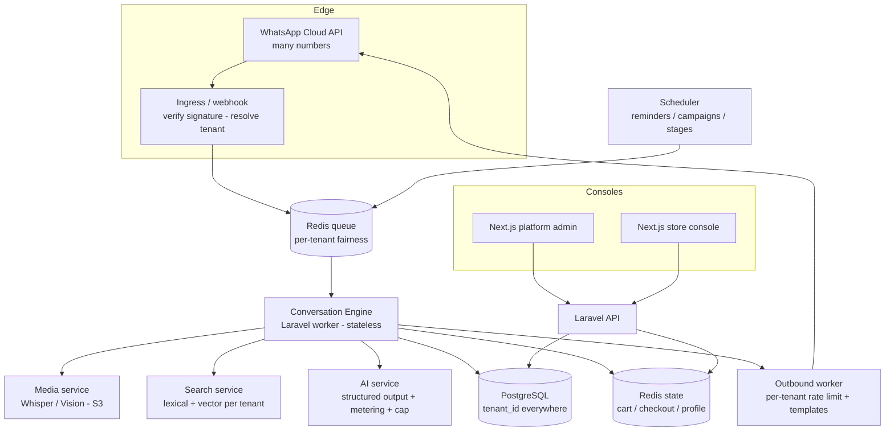

# CloudBSS — Platform Requirements & Architecture Blueprint

*Source of truth for behaviour: the production Family Shopper WhatsApp workflow.*
*Goal: preserve the business knowledge, discard the n8n shell, build a real multi-tenant SaaS.*

---

## 1. Business Rules — what the workflow actually encodes

The workflow is not "a chatbot." It is a **WhatsApp point-of-sale + conversational ordering engine** with a surprising amount of hard-won retail logic. Catalogued so it can be rebuilt cleanly:

**Core commerce processes**
- **Product search & ranking** — tokenise → drop ~300 stopwords/fillers → synonym-map → fuzzy match (typo-tolerant) → rank by relevance, *then stock, then popularity*; demote non-food when a food staple is asked for.
- **Cart management** — add / update (set qty) / remove (whole or N units) / clear; running quantities; 24-hour cart with **30-minute inactivity expiry**; a human-readable cart ref (`FS-YYYYMMDD-####`).
- **Conversational understanding** — multi-item splitting, quantity in *any* position, pronouns ("make it 5", "one more"), ordinals ("remove the second one"), arithmetic ("double it", "reduce by 2", "half"), replacement ("X instead of Y"), and **clarify-on-ambiguity** when one generic word maps to SKUs with a ≥3× price spread (never silently pick).
- **Checkout** — a strict state machine: collect *name* (accept "same" to reuse last) → *location* (WhatsApp pin preferred, else area+landmark) → confirm → place. **Phone is never asked** — the WhatsApp number is the delivery contact; only a *different* callback number is captured.
- **Order management** — gapless order numbers, dedup/order-lock (one order per customer per 120s), Postgres persistence, staff WhatsApp alert, and a saved "last order" enabling **reorder** and **order history** for 180 days.
- **Pricing** — store-wide discount engine (% or fixed) applied to the catalogue; **multi-currency localisation** (auto by country code: +211→SSP, +256→UGX; explicit request overrides; owner can force a default; USD converts the total only, SSP converts every amount with rounding).

**Operational/reliability rules (the unglamorous, essential part)**
- **Webhook dedup** (drop repeat deliveries), **message debounce/batching** (collapse rapid multi-bubble messages into one request), **echo/paste rejection** (customers paste the bot's own replies back), **blank-reply guard**, **stock-paste recognition**, and a **60-item cap** on giant pasted lists.
- **Human escalation** — "call me / manager / complaint" routes to staff, bypassing the bot.
- **Customer profiling** — accumulating per-customer language lean (Gujarati/Hindi/English), greeting style, visit count.

**What is *absent* (and the business clearly needs):** delivery/driver management, payment capture, inventory decrement, staff roles, branches, analytics. These are the white space CloudBSS fills (§4).

---

## 2. Customer Behaviour — how Kampala actually shops on WhatsApp

Mined from the defensive code (every guard exists because a real customer did the thing):

- **They send shopping lists, not queries.** Comma- or line-separated, sometimes pasted huge ("Need 2 sugar, 3 milk, 1 rice, 2 oil, 4 soda…"). The 60-item cap proves it.
- **Quantity goes anywhere, any form:** "2 sugar", "sugar 2", "vimal 2", "sugar x2", "2kg sugar", "2 pkt milk", "give me 4".
- **They mix languages, romanised.** Gujarati/Hindi/Hinglish/Gujlish: *sakar*=sugar, *tel*=oil, *doodh*=milk, *atta*=flour. They expect replies in plain English.
- **They fire rapid multi-bubble messages** ("rice" … "and sugar" … "2 bread") that must be understood as one order.
- **They edit mid-stream:** "make sugar 5, remove milk, add 2 bread, that's all."
- **They reference instead of naming:** "the cheaper one", "second one", "that one", "same again", "my usual".
- **They send media:** voice notes, photos of handwritten lists/products, PDFs, and **location pins**.
- **They open with culture-specific greetings** (Jai Shree Krishna / Namaste / Salaam) and expect them mirrored.
- **They negotiate** ("anything cheaper?") and **ask for options** ("more brands?").
- **They want a human sometimes** — complaints, callbacks, "talk to manager."

**Design implication:** CloudBSS must be *forgiving and conversational by default*, multilingual on input, English on output, media-aware, and edit-friendly. This is the product's moat — most competitors only handle "perfect" structured input.

---

## 3. CloudBSS Platform Requirements Document

### 3.1 Functional requirements

**A. Tenant & onboarding**
- Self-serve store signup; connect a WhatsApp number (Cloud API embedded signup / BSP); import catalogue (CSV/Sheets/API); set currency, discounts, staff, branches.
- Per-tenant branding, greeting, business hours, delivery zones/fees.

**B. Catalogue**
- Products with name, brand, keywords, category, price, stock, image, variants/sizes, barcode; bulk import + per-product edit; promotions (per-product %/fixed, date-bounded); stock tracking with decrement on order.

**C. Conversational commerce engine** (port the business rules in §1)
- Multilingual understanding, multi-item parsing, quantity/unit extraction, pronoun/ordinal/arithmetic edits, clarify-on-ambiguity, recommendations/related items, reorder/history, escalation.
- Deterministic cart + checkout state machine; English replies; currency localisation; message batching; dedup; echo-guard.

**D. Orders & fulfilment**
- Order lifecycle: New → Confirmed → Preparing → Ready → Out for delivery → Delivered (+ Cancelled/Returned); driver assignment; delivery fee by zone; ETA; **delivery reminders**; proof of delivery.

**E. Payments**
- Cash on delivery, bank transfer, and integrated mobile money / card (Flutterwave/Stripe) with webhook reconciliation; per-order payment state.

**F. Staff & operations**
- RBAC (owner / manager / dispatcher / agent), seat limits per plan; staff WhatsApp/console; audit log; cashbook.

**G. Marketing & retention**
- Campaigns/broadcasts via **approved WhatsApp templates** with opt-in/opt-out; customer segmentation (recent/inactive/VIP/category/language); AI-generated promo copy; scheduled sends with per-tenant throttle.

**H. Analytics**
- Sales, AOV, top products, conversion (chats→orders), repeat rate, language mix, campaign ROI, bot-vs-human handling, latency/error traces — per tenant and per branch.

**I. Billing (SaaS)**
- Subscription plans, usage metering (messages, AI tokens), spend caps, invoices.

### 3.2 Non-functional requirements
- **Multi-tenant isolation** (data + rate limits + AI budget per tenant).
- **Reliability:** at-least-once message processing, idempotency, graceful AI degradation, no SPOF.
- **Scale:** 10k tenants, millions of messages/day (§7).
- **Security/compliance:** webhook signature verification, encryption at rest/in transit, PII minimisation, WhatsApp commerce/marketing policy compliance, opt-out honoured, per-customer rate limiting.
- **Observability:** per-tenant tracing, structured logs, metrics, alerting.
- **Maintainability:** business logic in versioned, unit-tested services — not buried in config.

---

## 4. Missing Features (vs a modern SaaS)

| Feature | Status in workflow | Priority |
|---|---|---|
| Delivery & driver management, ETA, PoD | Absent | **High** |
| Delivery reminders | Absent | High |
| Integrated payments (mobile money/card) | Absent (COD/transfer text only) | **High** |
| Inventory decrement / low-stock alerts | Absent | High |
| Staff roles & permissions (RBAC) | Hardcoded numbers | **High** |
| Multi-branch | Absent | High |
| Marketing campaigns / broadcasts (templates) | Absent | High |
| Customer segmentation | Profiles exist, unused for marketing | Medium |
| Analytics / BI dashboards | Raw logs only | **High** |
| Self-serve onboarding + WhatsApp connect | Manual | **High** |
| Subscription billing + usage metering | Absent | High |
| Returns / refunds | Absent | Medium |
| Loyalty / coupons | Absent | Medium |
| Catalogue versioning / scheduled price changes | Partial (one discount) | Medium |
| Compliance: opt-in/opt-out, audit log | Absent | **High** |

---

## 5. SaaS Architecture (no n8n)

**Stack:** Next.js (admin + store console) · Laravel (API + workers) · PostgreSQL · Redis (queue + state) · S3-compatible storage · OpenAI · WhatsApp Cloud API.

**Multi-tenancy:** single Postgres, `tenant_id` on every row with composite indexes; **all Redis keys namespaced `t:{tenantId}:…`**; tenant resolved at ingress from the Cloud API `phone_number_id`. (Row-level isolation scales fine to 10k tenants with good indexing; reserve schema-per-tenant for rare heavy outliers.)



**Pipeline:** Cloud API → ingress (verify + resolve tenant + enqueue, return 200 fast) → queue → **stateless Conversation Engine** (the §1 rules, all deterministic, LLM optional) → outbound worker (rate-limited, template-aware). Admin/store consoles hit a normal REST/GraphQL API. A scheduler drives reminders, campaigns, and order-stage transitions.

**Why this beats n8n:** business logic is testable code; no parked executions; per-tenant isolation, rate-limits, and AI budgets; official WhatsApp transport (many numbers, deliverability, templates); horizontal scaling of stateless workers.

---

## 6. Product Search — an AI-first design

### 6.1 Why the workflow struggles
"Do you have rice and sugar?" and "2kg sugar and bread" misfire because of a **routing gap, not a parsing gap.** The deterministic multi-item engine only runs for the `cart_edit` intent; the router's quantity test (`\d+\s+`) fails on "2kg" (no space) and question-form messages have no digits, so both fall through to the `search` path where correctness depends on the LLM and on a possibly-invalid model string. The capable engine exists — it just isn't reached.

### 6.2 AI-first architecture (hybrid, grounded, degradable)
The right answer is **AI for understanding, deterministic code for truth.** The LLM never sees prices it can invent; it only structures intent.

```mermaid
flowchart LR
  M[Customer message] --> PRE[Cheap pre-parse<br/>split, qty/unit, synonyms, language]
  PRE --> RET[Retrieve candidates<br/>hybrid search: BM25/FTS + vector]
  RET --> LLM[LLM extractor<br/>structured output:<br/>intent + items[{query,qty,unit}] + refs]
  LLM --> RES[Deterministic resolver<br/>map each item to SKUs<br/>clarify on price spread]
  RES --> COMP[Response composer<br/>grouped numbered options<br/>cart / checkout engine]
  LLM -. unavailable/over-budget .-> DET[Deterministic parser<br/>graceful fallback]
  DET --> RES
```

1. **Pre-parse** (deterministic, free): split on connectors, pull quantity/unit, apply synonym map, detect language. Cheap, fast, language-robust.
2. **Retrieve** (per-tenant **hybrid search**): lexical (Postgres FTS / BM25) **+ vector** (embeddings in pgvector) so typos, synonyms, and multilingual terms match. Catalogue embedded once per tenant, cached in S3/pgvector, re-embedded on change.
3. **LLM extractor** (structured output / function-calling): given the message + retrieved candidates, return strict JSON `{intent, items:[{query, qty, unit}], references}`. The model **disambiguates and extracts** — it does **not** price or invent products.
4. **Deterministic resolver:** map each `query` to real SKUs from the retrieved set; apply the **clarify-on-price-spread** rule; compute prices from the catalogue only.
5. **Composer + cart engine:** render grouped, numbered options ("Rice: 1… / Sugar: 2…"), or auto-add when unambiguous and intent is explicit; drive the deterministic cart/checkout.
6. **Graceful degradation:** if the LLM is down or over a tenant's budget, the deterministic parser (§1) handles the turn. The bot never goes silent.

**Controls:** per-tenant token budget, spend cap, rate limit, cheap-model-default with escalation only on ambiguity, embedding cache, and full tracing. This is *AI-first* without being *AI-dependent*.

---

## 7. Final CloudBSS Blueprint — 100 → 1,000 → 10,000 stores

### 7.1 Capacity & scaling plan

| Concern | 100 stores | 1,000 stores | 10,000 stores |
|---|---|---|---|
| **WhatsApp** | Cloud API direct | Cloud API + BSP, template mgmt | Multi-BSP, per-number throughput pools |
| **Compute** | 1 API + few workers | Autoscaling worker pool, per-tenant queue fairness | Sharded worker fleets, regional |
| **Postgres** | Single + backups | + read replicas, partition logs by month | Partition by tenant/time, archival, possible Citus |
| **Redis** | Single | Cluster, key TTL hygiene | Sharded cluster, separate cache vs queue |
| **Search** | pgvector + FTS | pgvector tuned / Meilisearch | Dedicated vector/search cluster per shard |
| **AI** | Shared key + per-tenant meter | Multiple keys, budget tiers | Provider pool, routing, aggressive caching |
| **Storage** | S3 bucket | S3 + CDN | S3 + CDN + lifecycle policies |
| **Observability** | Logs + metrics | Per-tenant tracing/alerting | SLOs, anomaly detection, cost-per-tenant |

**What breaks first if you don't plan:** WhatsApp deliverability/limits and AI cost — both are *per-tenant budget* problems, solved by metering and templates, not bigger servers.

### 7.2 Cost & unit economics
Meter messages and AI tokens **per tenant**; enforce spend caps; default to a cheap model; cache embeddings and frequent intents. Bill plans against metered usage so a heavy tenant pays for itself. This is what makes 10k stores viable where the n8n single-key model never could.

### 7.3 Build order (pragmatic roadmap)
1. **Foundation:** multi-tenant Laravel + Postgres + Redis; Cloud API ingress; tenant resolution; outbound worker.
2. **Port the brain:** Conversation Engine (§1 rules) with unit tests; deterministic cart/checkout; hybrid search; AI-first extractor (§6) with metering.
3. **Console:** Next.js store console (catalogue, orders, chats, staff, settings) + platform admin.
4. **Fulfilment & payments:** order lifecycle, driver/delivery, reminders, integrated payments.
5. **Growth:** campaigns/templates, segmentation, analytics, AI promos, subscription billing.
6. **Scale-out:** replicas, partitioning, search cluster, multi-BSP, regional workers.

### 7.4 Guiding principles
- **Preserve the knowledge, replace the plumbing.** The §1 rules and §2 behaviours are the asset; n8n is not.
- **AI-first, never AI-only.** Deterministic truth + graceful degradation.
- **Tenant isolation is a first-class feature** — data, rate, and budget.
- **Official WhatsApp + template compliance** is the price of scale; pay it early.
- **Everything metered** so growth funds itself.

---

*The hard part — understanding messy, multilingual, real-world shopping over WhatsApp — is already solved and proven in production. CloudBSS's job is to give that proven brain a body that can carry 10,000 stores.*
